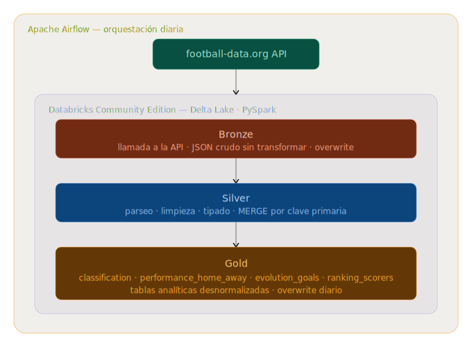

# Football Data Pipeline 🏆

End-to-end data pipeline that ingests daily match results, standings, and top scorers from the **5 major European football leagues** using the [football-data.org](https://www.football-data.org) API, processes them through a **Medallion architecture** (Bronze → Silver → Gold), and generates analytical tables ready for consumption.

---

## Architecture



The pipeline is orchestrated by **Apache Airflow** running locally via Docker. All data processing happens inside **Databricks Community Edition** using **PySpark** and **Delta Lake**.

```
football-data.org API
        ↓
Apache Airflow DAG (daily schedule)
        ↓
Databricks Community Edition
   ├── Bronze  → raw JSON as ingested from the API
   ├── Silver  → parsed, cleaned and typed data with MERGE
   └── Gold    → denormalized analytical tables
```

---

## Leagues covered

| Code | League |
|------|--------|
| `PL` | Premier League (England) |
| `SA` | Serie A (Italy) |
| `PD` | Primera División (Spain) |
| `BL1` | Bundesliga (Germany) |
| `FL1` | Ligue 1 (France) |

---

## Tech stack

| Tool | Purpose |
|------|---------|
| **Python** | API ingestion |
| **Apache Airflow** | Orchestration |
| **Databricks Community Edition** | Compute |
| **PySpark** | Data transformations |
| **Delta Lake** | Storage format (Bronze / Silver / Gold) |
| **Docker** | Local Airflow setup |

---

## Project structure

```
football-pipeline/
├── notebooks/
│   ├── 01_bronze.py       # API ingestion → raw Delta tables
│   ├── 02_silver.py       # Parsing, cleaning and MERGE
│   └── 03_gold.py         # Analytical aggregations
├── airflow/
│   ├── dags/
│   │   └── football_pipeline_dag.py   # Airflow DAG
│   └── docker-compose.yaml
├── architecture/
│   └── architecture.png
├── .gitignore
└── README.md
```

---

## Gold tables

| Table | Description |
|-------|-------------|
| `gold.classification` | Current standings for all 5 leagues |
| `gold.performance_home_away` | Home win %, away win % and draw % per league |
| `gold.evolution_goals` | Average goals per match by league and matchday |
| `gold.ranking_scorers` | Top 10 scorers per league with goals, assists and penalties |

---

## Pipeline flow

The DAG runs daily with the following task sequence:

```
ingest_bronze → check_matches → transform_silver → compute_gold
```

The `check_matches` task uses a `ShortCircuitOperator` — if there are no matches on a given day, the pipeline stops cleanly without executing Silver or Gold.

---

## Setup

### Prerequisites

- Docker Desktop
- Databricks Community Edition account
- football-data.org API token (free tier)

### 1. Clone the repository

```bash
git clone https://github.com/your-username/football-pipeline.git
cd football-pipeline
```

### 2. Start Airflow

```bash
cd airflow
echo "AIRFLOW_UID=$(id -u)" > .env
echo "AIRFLOW__WEBSERVER__DEFAULT_UI_TIMEZONE=Europe/Madrid" >> .env
echo "AIRFLOW__CORE__DEFAULT_TIMEZONE=Europe/Madrid" >> .env
docker compose up airflow-init
docker compose up -d
```

Access the UI at `http://localhost:8080` (user: `airflow`, password: `airflow`).

### 3. Configure Airflow variables

In the Airflow UI go to **Admin → Variables** and create the following:

| Key | Value |
|-----|-------|
| `DATABRICKS_HOST` | Your Databricks workspace URL |
| `DATABRICKS_TOKEN` | Your Databricks personal access token |
| `DATABRICKS_NOTEBOOK_BRONZE` | Path to `01_bronze` notebook in Databricks |
| `DATABRICKS_NOTEBOOK_SILVER` | Path to `02_silver` notebook in Databricks |
| `DATABRICKS_NOTEBOOK_GOLD` | Path to `03_gold` notebook in Databricks |

### 4. Configure Databricks

In your Databricks workspace:

- Upload the notebooks from the `notebooks/` folder to your workspace
- Store your football-data.org API token in Databricks Secrets using the Databricks CLI:
```bash
  databricks secrets create-scope --scope football_data_api_key
  databricks secrets put --scope football_data_api_key --key football_data_api_key
```
- Create the following schemas in your catalog: `bronze`, `silver`, `gold`

### 5. Trigger the pipeline

Enable and trigger the `football_pipeline` DAG from the Airflow UI.

---

## Key technical decisions

**Why store raw JSON as a string in Bronze?**
The football-data.org API returns nested JSON with fields that can be `null` before a match is played (e.g. `score`). Storing the entire payload as a JSON string avoids PySpark schema inference issues and respects the Bronze philosophy of keeping data exactly as received.

**Why overwrite in Bronze and MERGE in Silver?**
Bronze always receives the full season from the API on every call, so overwriting the entire table keeps it as a faithful snapshot of the latest API response. Silver uses MERGE to accumulate historical data without duplicates — if a match result changes between calls, MERGE correctly updates the existing record rather than inserting a duplicate.

**Why append for standings and overwrite for matches?**
Standings require the full API response object to preserve the `competition` context. Matches are individual records that can be safely extended into a flat list.

---

## Certification alignment

This project covers approximately **60-65% of the Databricks Data Engineer Associate exam** topics:

- Medallion architecture (Bronze / Silver / Gold)
- Delta Lake read and write
- MERGE INTO
- PySpark transformations
- Schema evolution
- Jobs and orchestration

---

## Future improvements

- Add data quality checks with Great Expectations
- Migrate storage from DBFS to Google Cloud Storage
- Add Databricks Workflows as an alternative orchestration layer
- Build a dashboard on top of the Gold tables

---

*Built as a learning project aligned with the modern tech market and the Databricks Data Engineer Associate certification.*
